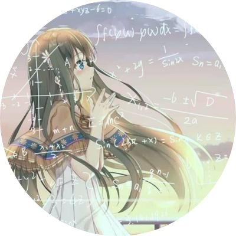

<!-- _coverpage.md -->

# Notes <small>Cloud Native</small>

> 基于 Obsidian+Docsify+Github Pages 的个人知识库

 

<!--  

    👀 访问量： 次

    | 🚴‍♂️ 访客数： 人

  -->

- 退役沃特卢er
- Gopher
- 云原生

[Blog](https://hyper2t.github.io/)
[Get Started](README.md)

<!-- 背景图片 -->
